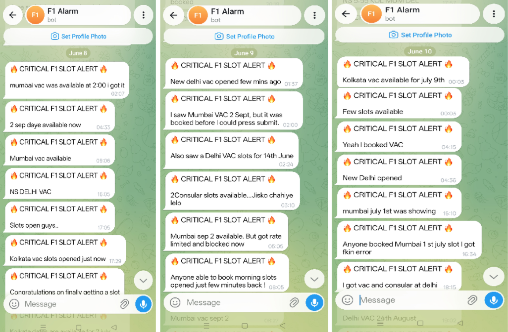
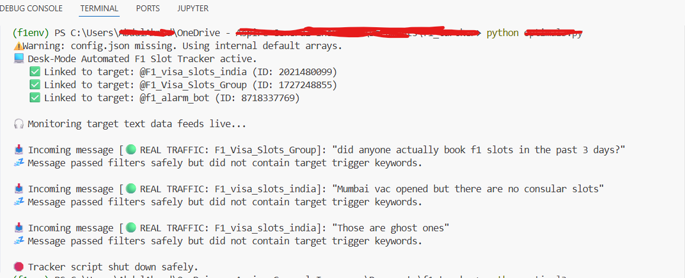
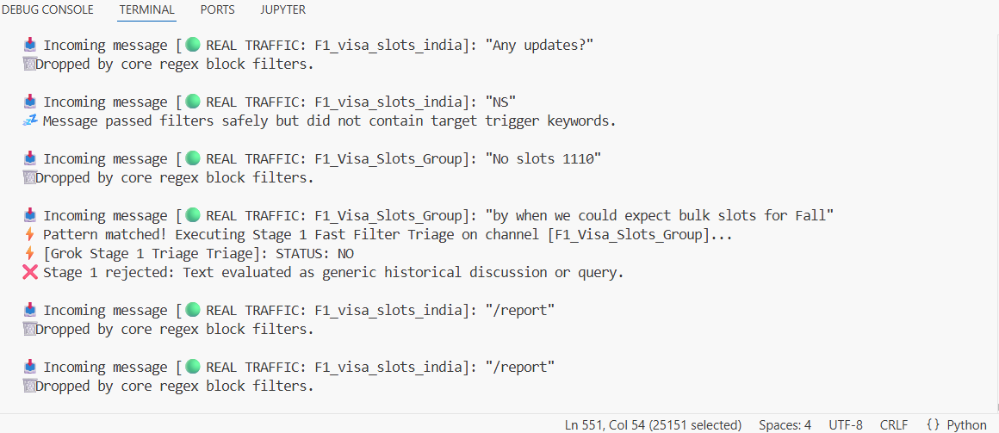

# Realtime US Visa F1 Slot Tracker & Intelligent Automation Engine (Latency under 60 seconds)
An advanced, asynchronous Python-based monitoring utility designed to track US F1 Visa slot availability across crowded Telegram communities. It mitigates false alarms by leveraging a two-stage evaluation pipeline powered by Llama-3.3-70b (via Groq) and takes immediate action through localized audio warnings and instant Telegram alert forwards.

## 🛡️ The Claim
💰 Zero Fee: Leverages an ultra-low-cost (virtually $0) infrastructure utilizing Groq's high-speed API endpoints to process thousands of community interactions daily without premium SaaS subscription fees.

🕞 24x7: Engineered specifically to tackle sudden, high-stakes bulk drops that notoriously occur in the dead of night (2 AM, 3 AM, or later), this system acts as your tireless digital sentinel. 

🌐 Cross Channel: Architected with a modular ingestion layer. The Telethon backend can be scaled instantly to monitor 50+ localized immigration channels, discord servers, or community feeds concurrently without degrading triage performance.


## 🚀 Key Features
Real-time Stream Monitoring: Tracks active message feeds from target Telegram communities concurrently using Telethon.

Two-Stage AI Validation (Groq Engine): * Stage 1 (Fast Triage): Instantly screens incoming alerts for potential drop occurrences.

Stage 2 (Context Verification): Opens a localized 30-second window to amass surrounding chat behavior and uses the LLM to run semantic, consensus-driven analyses to distinguish actual drops from false alarms or historical talk.

60-Second Target Latency Logic: The script acts as an optimized, local listener running on a dedicated machine. Within a 60-second window from a true group alert, it parses the threat, pushes clean notifications, and locks down UI automated portals.

Dynamic Content Filtering: Integrated system blocks common spam, query phrases, lookback indicators, and forward strings using custom regular expressions.

## 🚨 Dual-Channel Alert Output

Once a targeted event is officially confirmed by Stage 2, the system executes two parallel alert vectors:

📢 Local Hardware Sound Horn Alert: Triggers a persistent, high-frequency Windows audio beep loop (winsound) directly on the host laptop hardware unit to ensure immediate physical awareness.

🔊 Remote Notification Bot: Dispatches an instant alert through a personalized Telegram Bot, delivering a direct identity-link to the target conversation.


## 🛠️ Project Structure & Prerequisites
This application is built exclusively for Windows due to its deep integration with winsound and native desktop process triggers (chrome.exe, msedge.exe).

Installation
Clone or download this project directory to your local Windows machine.

Install all required upstream dependencies using the project's requirements file:

Bash
```
pip install -r requirements.txt
```

Keyword Configuration File (config.json)
Create a config.json file in your root folder to store regular expression filters. If this file is missing, internal defaults will be used:

JSON
```
{
  "SPAM_AND_JARGON": ["scam", "payment", "agent", "dm me", "paid slot"],
  "NEGATIONS": ["no slots", "closed", "locked", "finished", "gone"],
  "LOOSE_TALK": ["any updates", "when will slots open", "is it open", "predict"],
  "TEST_TRIGGER_KEYWORDS": ["slots opened", "bulk drop", "active", "open now", "go go"]
}
```

## ⚙️ Environment Variables Setup (.env)
Create a .env file in the root of your directory to manage credentials and configurations securely.

💡 System Concept: The specific Telegram client account configured here acts as your physical "listener node." When a drop is verified, you will immediately receive a notification via your personal bot showing you exactly which account/host machine has triggered the local automation and laptop audio sequence.

Code snippet
```
TELEGRAM_API_ID=
TELEGRAM_API_HASH=
ALERT_BOT_TOKEN=
MY_PERSONAL_CHAT_ID=
GROK_API_KEY=
```

## 🕹️ Workflow Architecture
Listen: The tracker hooks into targeted Telegram chats via app.py.

Regex Filter: Incoming traffic is stripped of obvious spam, negation statements, or looking-back text using strict regex evaluation blocks.

Stage 1 (Triage): If trigger words are found, the message is dispatched to llama-3.3-70b-versatile to parse semantic intent.

Stage 2 (Amass Window): If Stage 1 yields a YES, a strict isolated 30-second context window starts collecting group responses to evaluate collective group consensus.

Action Suite: If verified as authentic, the program activates an asynchronous sequence:

Dispatches a dedicated Telegram notification alert down to your personal chat interface, calling out the active connected listener account.

Plays a loud, distinct looping beep alarm directly on your computer speakers.


## System Architecture

```text
┌──────────────────────────────┐
│     Target Telegram Feeds    │
│  (Group Chat A /Group Chat B)│
└──────────────┬───────────────┘
      [New Message Inflow]
               ▼
┌──────────────────────────────┐
│     Regex Filtering Pass     │
│(Drops Spam & Historical Talk)│
└──────────────┬───────────────┘
        [Pattern Match]
               ▼
┌──────────────────────────────┐
│      Grok LLM: Stage 1       │
│        (Fast Triage)         │
└──────────────┬───────────────┘
          [Result: YES]
               ▼
┌──────────────────────────────┐
│    30-Second Context Window  │
│  (Amasses Live Group Chat)   │
└──────────────┬───────────────┘
       [Window Concludes]
               ▼
┌──────────────────────────────┐
│      Grok LLM: Stage 2       │
│    (Consensus Evaluation)    │
└──────────────┬───────────────┘
        [Drop Confirmed]
     ┌─────────┴─────────┐
     ▼                   ▼
┌───────────────────┐┌───────────────────┐
│  Laptop Hardware  ││   User Personal   │
│       Unit        ││      TG Bot       │
│(Windows Beep loop)││(Pushes Ident-Link)│
└───────────────────┘└───────────────────┘
```

## 📱 Personalised Alert to Telegram Chat (Mobile Screenshots)

Below are mobile screenshots demonstrating the pipeline in action. When a high-priority consensus is verified by the Stage 2 model, the system immediately pushes alerts directly to the personal Telegram Bot with instant access links.



## 🏎️ Running the Script

Execute the system by running the primary application script:

Bash
```
python app.py
```

## 📸 Live Tracking (Laptop Terminal Screenshots)

Below are the terminal logs showing real-time console telemetry as the pipeline ingests, triages, buffers, and triggers alerts on incoming telegram data packets.






## 🧪 Testing Environment
The framework includes simulated testing workers (manual_test_worker1, manual_test_worker2, etc.) mimicking authentic community interactions (e.g., false alarms, genuine chaos, or group panic). To safely stress-test your system pipelines without relying on active telegram drops, uncomment your target worker function inside the main() block initialization process.